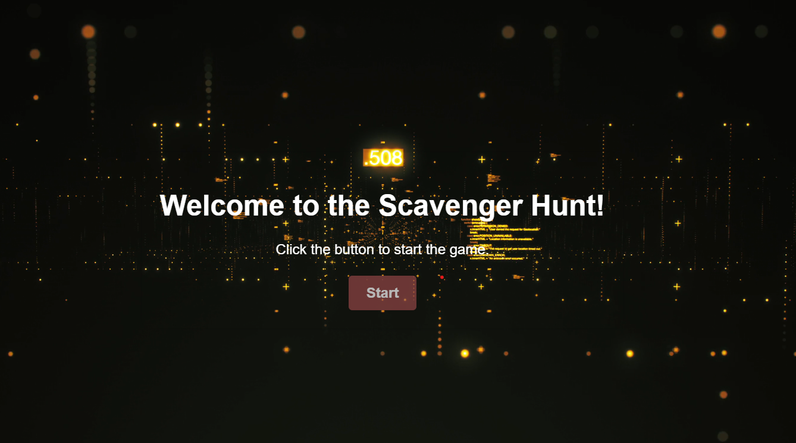
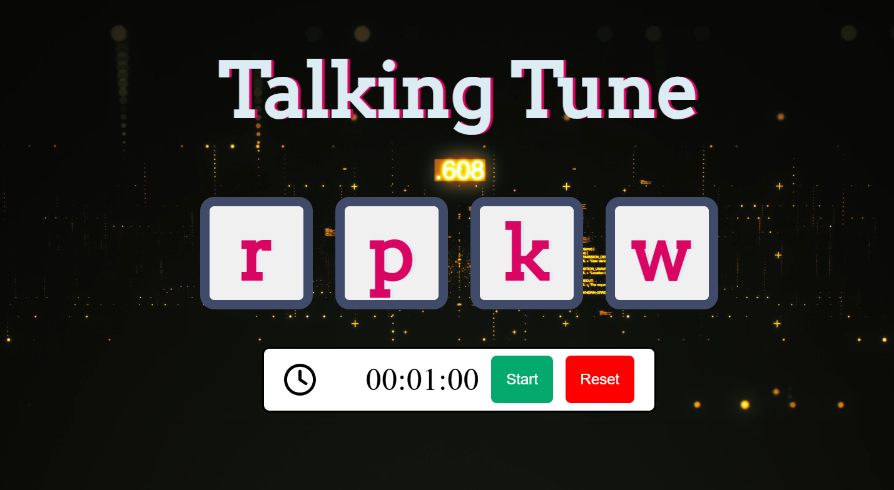

# 🎵 Talking Tunes

**Talking Tunes** is a fun, interactive web-based memory and reflex game where players must recreate a musical sequence by pressing keyboard keys associated with different sounds.

🕹️ [Play game](https://kshitijgupta0707.github.io/TalkingTune/)🕹️ 

---

## 🧠 About the Game

In **Talking Tunes**, each keyboard key is randomly mapped to a unique sound. A sequence of sounds is displayed on the screen, and your goal is to play the correct sequence by hitting the corresponding keys.

- ✅ Press the correct keys in the exact sequence → **You win!**
- ❌ Press a wrong key → The game **restarts from the beginning**

It's a perfect blend of memory, rhythm, and quick reflexes!

---

## 📸 Screenshots

 

 

---
##  Features

-  Random sound-key mapping every game  
-  Sequence-based gameplay  
-  Automatic reset on incorrect input  
-  Real-time sound feedback  
-  Browser-based — no installation needed  

---

## Tech Stack

- **HTML5**
- **CSS3**
- **JavaScript**

---

## 👨‍💻 Developer

Created by **Kshitij Gupta**  
👨‍🔬 Built as part of the **Optica Society** tech desk initiative  
🎓 Role: **Tech Volunteer, 2nd Year**

---

## 🚀 Future Improvements

- Sound sequence difficulty progression  
- Score tracking system  
- Leaderboard for fastest completion times  
- Mobile support  

---

Feel free to clone, contribute, or fork the project!
